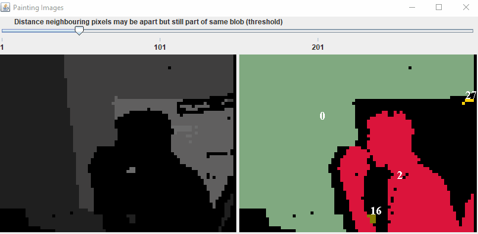

# DepthImageSegmentation
A Java Swing application that attempts to segment depth images into their respective "Pixel Blobs"

## Description
A Depth image is a like a regular image except at each pixel position in the image instead of the color of the pixel being stored it is the distance of that pixel from the camera. Depth images make it easier to segment images into the real-world objects that are in the image because neighbouring pixels are close in distance from the camera. Whereas in typical images the RGB color of a pixel may have little to do with where the real-world object the pixel relates to is positioned in the world. 

In this project, an undirected graph was implemented to store all pixels in an image. The graph is traversed using Depth First Search.
